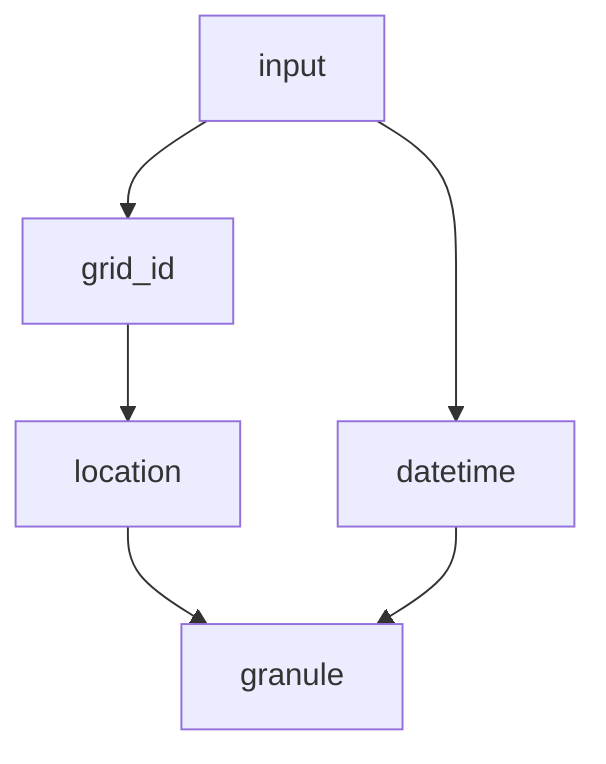

# Overview

Given `datetime`, and `grid_id`, we need to produce `value`

- `grid_id`: A 5-character alphanumeric ID that uniquely identifies a 5x5cm grid
  cell
- `value`: A float indicating the average daily reference-grade monitor
  measurement for PM2.5
- `location` can be fetched from [grid metadata](GridMetadata.ipynb)
- `granule` can be fetched from [satellite metadata](SatelliteMetadata.ipynb),
  and [HDF Images](HdfImage.ipynb)

> Remember that you are not allowed to use future data, so the time_end of an
> granule must occur on the same day of a given observation

[MAIAC data](https://lpdaac.usgs.gov/products/mcd19a2v006/)

